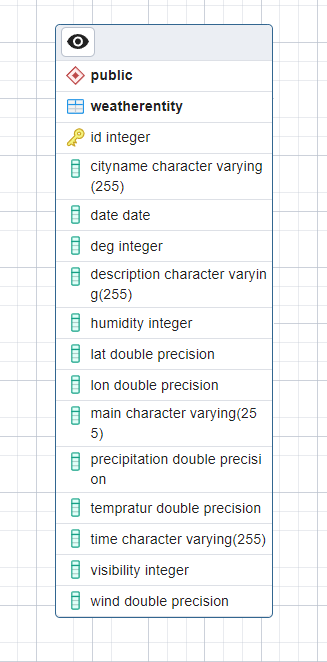

# WeatherDataProject
Hold B Gruppe 7

Morten, Dimitra, Jakob

**<h3>1. A Description of work progress:</h3>**

We decided to work every day in class like last time.  
We feel like we work better and more efficiently as a group this way.
We've used Kanban boards, Github Desktop, IntelliJ 2023.2.1. 
We've also used Docker Desktop, Pgadmin, 
We've also used things like Discord to communicate when not together physically.

**<h3>2. Business Model:</h3>**

We would like to be able to webscrape weather-data from the website TV2Vejret.
Afterwards we would like to add additional weather data from Openweathermap.org API to 
enrich the information we've webscraped. Then Organizing the information, adding it together and finally adding
the information to a database where we can keep info.  
So in short: Get weather data from TV2, get additional weather data from Openweathermap API
Combine the data and put the data into a database.

**<h3>3. Picture of EER Diagram:</h3>**

**<h3>4. Documentation: </h3> **
We've used the website https://vejr.tv2.dk/ to webscrape information from.  

We then used the API https://openweathermap.org/current to Enrich our information.  

This is the API We used: https://api.openweathermap.org/data/2.5/weather 

From the API we Enriched our Weather information with additional Weather information, including
things like:    Longtitude, Latitude, A text description of the weather, Humidity levels and wind degrees.

<h3>Edge Cases:</h3>

Edge cases for a project like this would or could include things such as:  

- **Missing Data on the Website:  **
**Edge Case:** The website we are scraping from lacks information in certain areas or locations.  
**Fix:** We made it so within our Webscraping class that if there are tables with no information, or empty tables, they will be ignored.

- **Rate Limiting or IP Blocking:**  
**Edge Case:** The website detects a high volume of requests from our IP address and blocks or limits further access.  
**Potential Fix:** Our project only scrapes when we run it, so the chance of us overloading the website and getting IP blocked is very low.
However, if we had some automatic scraping system or had to scrape many times in a row, or in a loop, then adding a delay with Thread.sleep() for example would be handy
so that you don't overload the server and get yourself IP Blocked.

- **Website Downtime or Maintenance:**  
  **Edge Case:** The website we are scraping from is temporarily down or undergoing maintenance.  
  **Potential Fix:** We could put our scraping action into an If statement and loop that will continuously run until it succeeds by getting information back.
This is where a downtime/delay in the loop would be great to implement.

**<h3> Exception Handling </h3>**
For exception handling we have decided to use them where it would be likely to get an exception.
This includes the API call in WeatherAPIReader where we try catch for an IOException (Input/output Exception) in case a connection to the API can't be created.
It then throws a RuntimeException which stops the program.

Another usage of Exception handling is in WeatherDataDTO where we have made the scanner input recursive if the user types a wrong city.
When input is one of the correct cities, it will continue running. Else it will give an error string and make a recursive call.

**<h3> Potential Improvements:</h3>**
Potential improvements for this project would be to call our classes something more telling, as they all share very similar names and thus are a bit confusing.
If we had a few more specific classes like DTOs, DAOs, Entities etc. We could make packages to put them in for order and easier management.
However, we only have 1 or 2 of each, so we felt like it wasn't necessary in this project.
We could also have made the calls to API and webscraping put into loops in case the server was down to prevent edge cases, so that we wouldn't have to run the program over and over until we finally established a connection again. (When their servers were up).
PSA: Remember to add a delay if you run it in a loop or you might end up sending too many requests and getting yourself IP blocked. 
